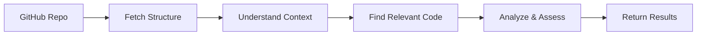

# PRA Assessment API

Automate Platform Readiness Assessments for GitHub repositories using AI-powered analysis.

## What It Does

This API analyzes your GitHub repository against a checklist of best practices and standards, providing detailed feedback on each item. It uses Google's Gemini AI to understand your code and assess compliance.

## Quick Start

### Prerequisites

- Java 21
- sbt
- Gemini API Key ([get one here](https://ai.google.dev))

### Setup

1. **Configure your API key**

   Create `conf/local.conf`:
   ```hocon
   pra.assessment.gemini.apiKey="YOUR_GEMINI_API_KEY"
   ```

2. **Run the application**
   ```bash
   sbt run
   ```

3. **Assess a repository**
   ```bash
   curl "http://localhost:9000/assess/batch?repoUrl=https://github.com/hmrc/pillar2-frontend"
   ```

## How Assessments Work

The API follows a systematic process to analyze your codebase:



### The Assessment Process

1. **Fetch Repository Structure**
   
   The API retrieves your repository's file tree to understand its organization.

2. **Generate Context**
   
   AI analyzes the structure and creates a summary of your project (e.g., "Play Framework app with MongoDB persistence").

3. **Smart File Discovery**
   
   For each check, the AI:
   - Generates relevant search terms (e.g., "AuthConnector" for auth checks)
   - Searches GitHub to find matching files
   - Selects the most relevant files to examine

4. **Batch Assessment**
   
   Related checks are grouped and assessed together for efficiency. The AI examines the selected files and provides:
   - **Status**: PASS, FAIL, WARNING, or N/A
   - **Confidence**: How certain the AI is (0.0 to 1.0)
   - **Reason**: Explanation of the assessment
   - **Evidence**: Links to specific code locations

5. **Return Results**
   
   All assessments are returned as a JSON array.

## Usage Examples

### Basic Assessment

```bash
curl "http://localhost:9000/assess/batch?repoUrl=https://github.com/your-org/your-repo"
```

### Specify a Template

```bash
curl "http://localhost:9000/assess/batch?repoUrl=https://github.com/your-org/your-repo&templateId=mdtp-pra"
```

### Use a Different AI Model

```bash
curl "http://localhost:9000/assess/batch?repoUrl=https://github.com/your-org/your-repo&model=gemini-2.5-pro"
```

## Response Format

```json
[
  {
    "checkId": "1.A",
    "checkDescription": "Does the service implement any non-standard patterns?",
    "status": "PASS",
    "confidence": 0.9,
    "requiresReview": false,
    "reason": "Service follows standard MDTP patterns using Play Framework and standard libraries.",
    "evidence": [
      {
        "githubUrl": "https://github.com/hmrc/repo/blob/main/app/config/AppConfig.scala#L10-L20"
      }
    ]
  }
]
```

## Available Templates

### MDTP PRA (Default)

Comprehensive assessment covering:
- **Build & Resilience**: Dependencies, HTTP usage, timeouts
- **Data Persistence**: MongoDB usage, TTL configuration, encryption
- **Security**: Authentication and authorization
- **Admin Services**: Access control
- **Logging & Auditing**: PII handling, audit events
- **Testing**: Unit, integration, and accessibility tests

### Test Template

Minimal template for testing the API.

## Why It's Efficient

Traditional code analysis tools send entire repositories to AI models, consuming massive amounts of tokens. This API is different:

- **Smart Discovery**: Only examines files relevant to each check
- **Shared Context**: Generates project summary once, reuses it
- **Batch Processing**: Groups related checks together
- **Search Integration**: Uses GitHub's search to narrow down files before AI analysis

This approach reduces token usage by ~90% compared to naive implementations.

## Testing

```bash
# Run all tests
sbt test

# Run integration tests (requires API key)
sbt "testOnly integration.*"
```

## Creating Custom Templates

Templates define what to assess. Create one in `app/templates/TemplateRegistry.scala`:

```scala
val myTemplate = AssessmentTemplate(
  id = "my-template",
  name = "My Custom Assessment",
  description = "Assesses compliance with our standards",
  basePrompt = "You are an expert in our coding standards...",
  contextResources = Seq(
    ContextResource(
      name = "Coding Standards",
      url = "https://example.com/standards",
      description = "Our official coding standards"
    )
  ),
  checks = Seq(
    CheckItem("1.A", "Is error handling implemented correctly?"),
    CheckItem("1.B", "Are tests comprehensive?")
  )
)
```

## License

Apache 2.0
