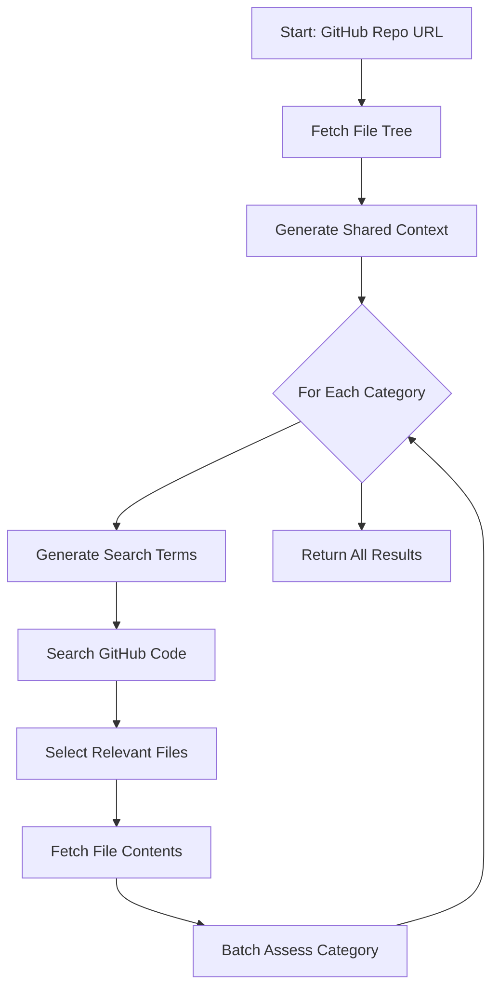

# PRA Assessment API

A prototype API for automating Platform Readiness Assessments (PRA) using Gemini LLM with type-safe assessment templates.

## Overview

This API automates PRA assessments for GitHub repositories using Google's Gemini LLM. It intelligently analyzes codebases against customizable assessment templates, providing detailed results with evidence and confidence scores.

## Features

- **Batch Assessment API**: Complete assessment results in a single JSON response
- **Template System**: Type-safe assessment templates with context resources and customizable base prompts
- **Thinking Mode**: Uses Gemini 2.5 Flash with dynamic thinking for improved reasoning
- **Dynamic Search**: LLM generates search terms to find relevant files
- **Smart File Selection**: Intelligently selects relevant files for each check (Token Efficient)
- **GitHub Integration**: Fetches file trees and content directly from GitHub
- **Context-Aware**: Templates include reference resources (e.g., MDTP Handbook) for LLM

## How It Works

The assessment process follows these steps:



### Step-by-Step Process

1. **Fetch File Tree**
   - Retrieve complete file structure from GitHub API
   - Used to understand project organization

2. **Generate Shared Context**
   - LLM analyzes file tree and template resources
   - Creates concise summary of project structure
   - Reused across all checks for efficiency

3. **For Each Category** (e.g., Security, Data Persistence):

   a. **Generate Search Terms** (Dynamic)
      - LLM analyzes check descriptions
      - Generates 3-5 relevant search terms
      - Examples: "AuthConnector", "Mongo", "Upscan"

   b. **Search GitHub Code**
      - Use GitHub Search API with generated terms
      - Find files likely to contain relevant code
      - Gracefully handles rate limits

   c. **Select Relevant Files**
      - LLM picks top 5-10 files for the category
      - Considers both file tree and search results
      - Prioritizes files found via search

   d. **Fetch File Contents**
      - Retrieve actual code from selected files
      - Handle errors gracefully

   e. **Batch Assess Category**
      - LLM assesses all checks in category at once
      - Uses thinking mode for better reasoning
      - Returns structured results with evidence

4. **Return All Results**
   - Combine results from all categories
   - Return as JSON array

## Token Efficiency Strategy

This API is designed to be highly token-efficient:

1.  **Dynamic Discovery**: Instead of sending the entire repository, the API selects only relevant files
2.  **Shared Context**: Project summary generated once and reused
3.  **Batch Processing**: Multiple checks assessed together
4.  **Smart Search**: GitHub Search API narrows down relevant files before LLM selection

## Prerequisites

- Java 21
- sbt
- A valid Gemini API Key

## Configuration

1. Create a `conf/local.conf` file (this file is gitignored):
   ```hocon
   pra.assessment.gemini.apiKey="YOUR_GEMINI_API_KEY"
   ```
2. Ensure `conf/application.conf` includes `local.conf`:
   ```hocon
   include "local.conf"
   ```

## Running the Application

To run the application locally:

```bash
sbt run
```

The API will be available at `http://localhost:9000`.

## Usage

### Batch Assessment

To assess a repository with the default template (MDTP PRA):

```bash
curl "http://localhost:9000/assess/batch?repoUrl=https://github.com/hmrc/pillar2-frontend"
```

### Template Selection

To use a specific assessment template:

```bash
curl "http://localhost:9000/assess/batch?repoUrl=https://github.com/hmrc/pillar2-frontend&templateId=mdtp-pra"
```

### Model Selection

To use a specific Gemini model (default is `gemini-2.5-flash`):

```bash
curl "http://localhost:9000/assess/batch?repoUrl=https://github.com/hmrc/pillar2-frontend&model=gemini-2.5-pro"
```

### Available Templates

- **`mdtp-pra`** (default): MDTP Platform Readiness Assessment
    - Comprehensive check (~25 items) covering:
        - Build & Resilience (Dependencies, HTTP Verbs, Timeouts)
        - Data Persistence (Mongo, TTL, Encryption)
        - Security (Auth usage)
        - Admin Services
        - Logging & Auditing
        - Testing & Accessibility
- **`test`**: Minimal template for testing purposes

### API Endpoints

#### `GET /assess/batch`

Returns a complete assessment as a JSON array.

**Query Parameters:**
- `repoUrl` (required): GitHub repository URL
- `templateId` (optional): Assessment template ID (default: `mdtp-pra`)
- `model` (optional): Gemini model name (default: `gemini-2.5-flash`)

**Response:**
```json
[
  {
    "checkId": "1.A",
    "checkDescription": "Does the service implement any non-standard patterns?",
    "status": "PASS",
    "confidence": 0.9,
    "requiresReview": false,
    "reason": "Service follows standard MDTP patterns...",
    "evidence": [
      {
        "githubUrl": "https://github.com/hmrc/repo/blob/main/app/config/AppConfig.scala#L10-L20"
      }
    ]
  }
]
```

**Status Values**: `PASS`, `FAIL`, `WARNING`, `N/A`

**Error Responses:**
- `400 Bad Request`: Invalid GitHub URL
- `429 Too Many Requests`: Rate limit exceeded (includes retry delay)
- `500 Internal Server Error`: Assessment failed

## Testing

Run all tests:
```bash
sbt test
```

Run integration tests (requires Gemini API key):
```bash
sbt "testOnly integration.*"
```

## Architecture

### Key Components

- **`AssessmentController`**: HTTP endpoint handling
- **`AssessmentOrchestrator`**: Coordinates the assessment workflow
- **`GeminiService`**: LLM integration (context generation, file selection, assessment, search term generation)
- **`GitHubConnector`**: GitHub API integration (file tree, content, code search)
- **`TemplateRegistry`**: Assessment template definitions

### Assessment Templates

Templates are defined in `app/templates/TemplateRegistry.scala` and include:
- **ID**: Unique identifier
- **Name**: Human-readable name
- **Description**: Template purpose
- **Base Prompt**: LLM instructions and persona
- **Context Resources**: Reference materials (e.g., MDTP Handbook)
- **Checks**: List of assessment items

## Adding New Templates

To add a new assessment template, update `app/templates/TemplateRegistry.scala`:

```scala
val myTemplate = AssessmentTemplate(
  id = "my-template",
  name = "My Assessment Template",
  description = "Description of what this template assesses",
  basePrompt = "You are an expert assessor for...",
  contextResources = Seq(
    ContextResource(
      name = "Reference Guide",
      url = "https://example.com/guide",
      description = "Official standards and patterns"
    )
  ),
  checks = Seq(
    CheckItem("1.A", "First check description"),
    CheckItem("1.B", "Second check description")
  )
)
```

## License

This code is open source software licensed under the [Apache 2.0 License](http://www.apache.org/licenses/LICENSE-2.0.html).
